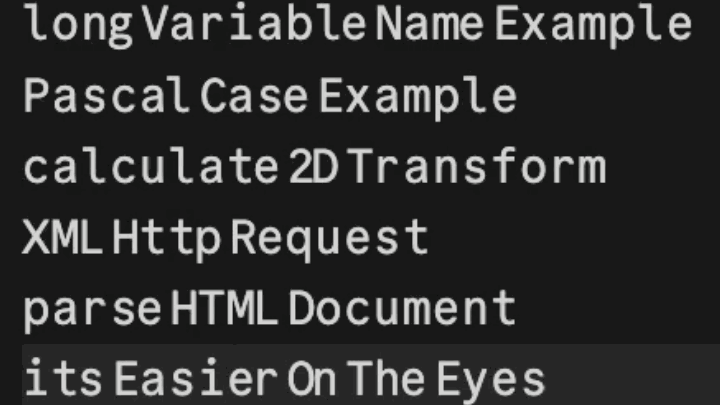

# Camel Mono



Motivation - after watching a [Syntax](https://www.youtube.com/@syntaxfm) epsiode where they discussed `snake_case` being easier to read than `camelCase` (see relevant [study](https://www.cs.kent.edu/~jmaletic/papers/ICPC2010-CamelCaseUnderScoreClouds.pdf)). I wondered if there was a way to improve the legibility for `camelCase`.

Camel Mono is the result of that thought experiment. It is a derivative of [Commit Mono](https://github.com/eigilnikolajsen/commit-mono) that adds subtle gaps at `camelCase` word boundaries, so `getUserName` reads more like `get User Name`. You get the visual clarity of `snake_case` without changing the code.

Column alignment stays monospace: glyphs shift inside their fixed-width cells using GSUB contextual substitution, pre-shifted alternate glyphs are selected at each boundary.

## Installation

Pre-built fonts are in `fonts/`. Install the `.otf` files on your system like any other font (Windows, macOS, Linux).

[Camel Mono 400 download link](https://raw.githubusercontent.com/TJHdev/camel-mono/main/fonts/CamelMonoV1-400Regular.otf)

## Enable camelCase spacing

The feature fires automatically via `calt` (contextual alternates), which most editors enable by default, no configuration needed.

```json
"editor.fontFamily": "Camel Mono 400",
"editor.fontLigatures": "'calt'",
```

**VS Code / cursor**

```json
{
  "editor.fontFamily": "Camel Mono 400",
  "editor.fontLigatures": "'calt'"
}
```

**JetBrains IDEs** 
```
Settings → Editor → Font → Enable font features → add `calt`.
```


**Neovim (Kitty)** 
```
font_features CamelMonoV1-400Regular +calt
```

**Ghostty**
```
font-family = Camel Mono 400
font-size = 13
font-feature = calt
```

**CSS**

```css
font-family: "Camel Mono 400", monospace;
font-feature-settings: "calt" 1;
```

## Boundary patterns

Three boundary types are recognised:

| Pattern | Example | Description |
|---------|---------|-------------|
| `[a-z][A-Z0-9]` | `getUserName`, `get2DPoint` | Standard camelCase |
| `[A-Z0-9][A-Z0-9]…[a-z]` | `HTTPSConnection` | Acronym/number run into lowercase |
| `[a-z][A-Z0-9][A-Z0-9]…[a-z]` | `fromAPension`, `q9Do` | Lowercase into acronym start |

Digits are treated as uppercase-equivalent, so `get2DPoint` and `q19Do` produce the same gap as letter boundaries.

## License

Font software: SIL Open Font License 1.1 (`LICENSE-FONT`).

Based on Commit Mono by Eigil Nikolajsen. This derivative uses the name **Camel Mono** / **CamelMono**.
